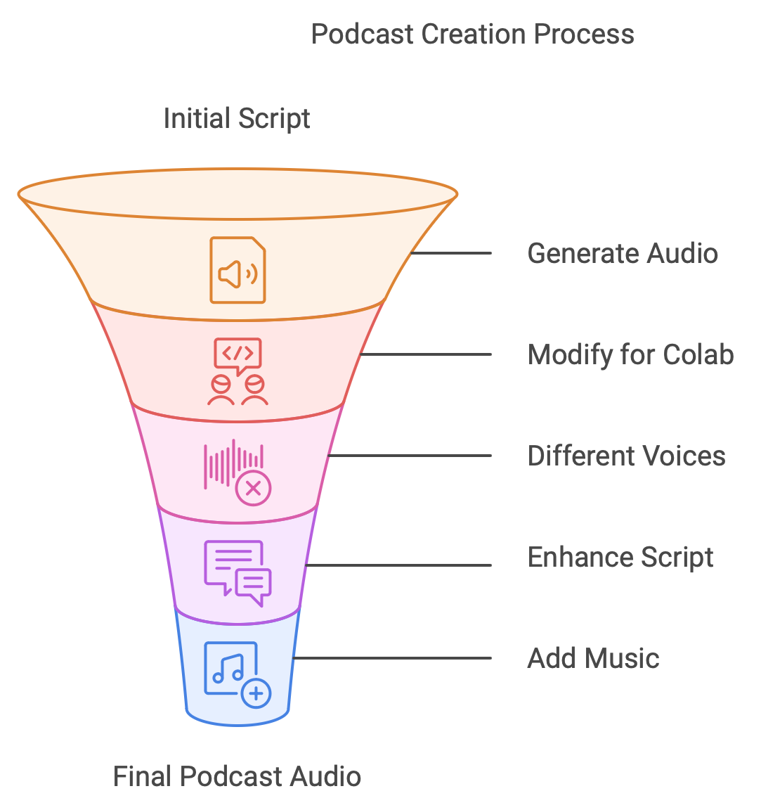

| **Date**       | **Task Description**                                                                                     | **Tools/Technologies**            | **Status**         |
|----------------|---------------------------------------------------------------------------------------------------------|----------------------------------|--------------------|
| **Initial Chat** | Converted the provided text about Don Corleone’s leadership into a two-person podcast script, featuring Sarah and Dave as hosts. | Script Writing, OpenAI Text Generation | Completed    |
| Audio Generation| Provided Python code to generate audio files for a podcast script and merge them into one file.          | gTTS, pydub                      | Completed          |
| Colab Support  | Modified the script to run on Google Colab, installed necessary dependencies (`gTTS`, `pydub`, `ffmpeg`). | Google Colab, Python             | Completed          |
| Different Voices| Updated the code to use different voices for Sarah and Dave by assigning different accents in `gTTS`.    | gTTS                             | Completed          |
| Conversational Script | Enhanced the podcast script for a more conversational tone using OpenAI text generation techniques.| OpenAI Text Generation           | Completed          |
| Eleven Labs TTS | Provided Python code for using Eleven Labs API to generate distinct male and female voices for the podcast. | Eleven Labs API, requests        | Completed          |
| Script Generation from Text | Converted user-provided text about Don Corleone's leadership into a natural conversation between two podcast hosts (Sarah and Dave). | OpenAI Text Generation           | Completed          |
| Music Addition | Added functionality to insert intro and outro music before and after the podcast audio.                  | pydub                            | Completed          |
| .wav File Support | Updated the code to allow `.wav` files for intro and outro music, alongside `.mp3` support.           | pydub                            | Completed          |
| Fade Effects   | Implemented fade-in and fade-out effects on the intro and outro music (3 seconds each).                  | pydub                            | Completed          |
| README Creation| Created a detailed `README.md` for the Jupyter notebook covering all functionalities and setup instructions. | Markdown, Documentation          | Completed          |
| Work Report    | Generated a work report table summarizing the entire chat and tasks completed.                           | Documentation                    | Completed          |

---

Generated using ChatGPT-4o

